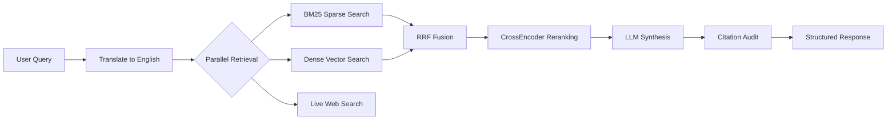
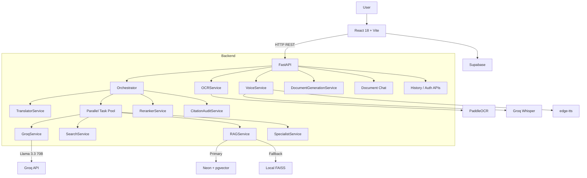

# LegalSarathi

**Live App:** https://legal-sarathi.vercel.app/

> **Overview:** LegalSarathi is a multilingual Indian legal AI platform that combines LLMs, hybrid retrieval, citation verification, document intelligence, and voice/OCR interfaces to help users understand legal situations and take practical next steps. Instead of relying on an LLM alone, it grounds responses in a searchable legal corpus, re-ranks retrieved evidence, checks citations after generation, and can also analyze uploaded documents and generate structured legal drafts.

LegalSarathi is designed around a simple idea: **legal AI should be accessible in the language people are comfortable using, while still being grounded in source material.**

---

## Why this project?

Legal information is often difficult to access for non-lawyers because of legal terminology, language barriers, and the amount of source material that must be searched before reaching a useful answer.

LegalSarathi approaches that problem as an **AI systems engineering problem**, not just a chatbot problem:

- Accept questions in multiple Indian languages.
- Translate queries into a representation that works well for retrieval and LLM reasoning.
- Combine **sparse keyword retrieval** and **dense semantic retrieval**.
- Fuse the two retrieval signals with **Reciprocal Rank Fusion (RRF)**.
- Re-rank candidates with a **CrossEncoder** before generation.
- Add live web context when needed.
- Generate structured answers with an LLM.
- Audit citations after generation against the retrieved legal chunks.
- Support voice input, OCR for uploaded documents, document chat, and legal-document generation.
- Cache repeated single-turn queries to avoid unnecessary recomputation.

---

## Highlights

| Capability | Implementation |
|---|---|
| Multilingual legal assistance | Indic-language input/output with translation layer |
| Hybrid RAG | BM25 + dense vector retrieval + RRF |
| Semantic reranking | `cross-encoder/ms-marco-MiniLM-L-6-v2` |
| LLM synthesis | Groq `llama-3.3-70b-versatile` |
| Citation verification | `CitationAuditService` validates cited section IDs |
| Vector search | Neon PostgreSQL + pgvector, with local FAISS fallback |
| Embeddings | `sentence-transformers/paraphrase-multilingual-MiniLM-L12-v2` |
| Live legal context | Tavily / Serper search integration |
| Voice | Groq Whisper STT + edge-tts |
| OCR | PaddleOCR for image/PDF text extraction |
| Document chat | Context-constrained chat over uploaded documents |
| Legal document generation | Jinja2-based templates with structured fields |
| Observability | Optional Langfuse traces and citation-quality score |
| Performance | Async orchestration, parallel retrieval, and LRU caching |
| Frontend | React 18 + Vite |
| Backend | FastAPI + Uvicorn |
| Auth / data services | Supabase |
| Database | Neon PostgreSQL / pgvector |

---

## Core Features

### 1. Multilingual Legal Assistant

The application supports legal questions across a broad set of Indian languages. The current language map includes:

**Hindi · Tamil · Telugu · Marathi · Bengali · Gujarati · Kannada · Malayalam · Punjabi · Urdu · Odia · Assamese · English**

The backend can use a fast translation path for development or a local IndicTrans2-based backend when configured.

---

### 2. Hybrid Retrieval-Augmented Generation

The core legal-answering workflow does not depend on a single retrieval method.

A query passes through multiple stages:



### Retrieval stages

**Sparse retrieval — BM25**

BM25 captures exact legal terminology, statute names, section numbers, and important keywords.

**Dense retrieval — Sentence Transformers + vector search**

The project uses:

`sentence-transformers/paraphrase-multilingual-MiniLM-L12-v2`

The resulting embeddings can be queried against **Neon pgvector** or the local **FAISS** fallback.

**Reciprocal Rank Fusion**

Instead of trying to directly average incompatible BM25 and vector similarity scores, LegalSarathi combines rankings using RRF.

```text
score(d) = 1 / (k + rank_dense)
         + 1 / (k + rank_sparse)
```

The implementation uses `k = 60`.

**CrossEncoder reranking**

The merged candidates are then scored again using:

`cross-encoder/ms-marco-MiniLM-L-6-v2`

Only the highest-ranked legal chunks are forwarded to the synthesis stage.

---

## Citation-Grounded Generation

One of the main design goals is to make generated legal guidance easier to trace back to retrieved material.

The pipeline injects the retrieved section IDs into the LLM context and instructs the model to cite them using identifiers such as:

```text
[BNS_73]
[BNSS_50]
[CONST_22]
```

After generation, `CitationAuditService`:

1. Extracts explicit citation IDs from the answer.
2. Looks for inline section references.
3. Compares cited IDs with the retrieved section IDs.
4. Produces:
   - verified citations
   - unverified citations
   - retrieved-but-uncited chunks
   - a `citation_score`
   - a human-readable verification badge

This makes citation checking a **post-generation validation step**, rather than assuming that an LLM citation is correct simply because it looks plausible.

---

## Parallel Backend Orchestration

The main query flow is coordinated by the `Orchestrator`.

For a cache miss, the system:

1. Translates the incoming query.
2. Runs legal-key extraction, web search, hybrid retrieval, and optional specialist inference concurrently.
3. Re-ranks the retrieved legal chunks.
4. Builds the final RAG context.
5. Calls Groq for structured synthesis.
6. Audits citations against the retrieved evidence.
7. Returns structured JSON to the frontend.

The orchestration uses `asyncio.gather` and `asyncio.to_thread` where appropriate.

### LRU caching

Single-turn queries are cached in an in-memory LRU cache.

- Maximum entries: `100`
- TTL: `1 hour`

This avoids repeating translation, retrieval, reranking, and generation for identical recent requests.

---

## Multimodal Legal Assistance

### Voice input

The voice pipeline uses:

- **Groq Whisper**: `whisper-large-v3-turbo` for speech-to-text
- **edge-tts** for text-to-speech

Users can submit voice queries and receive synthesized spoken responses.

### OCR / document analysis

Uploaded legal PDFs and images can be processed with **PaddleOCR**.

The backend supports:

- OCR extraction only
- OCR + legal query
- Document-specific chat over extracted content

Document chat deliberately bypasses the normal legal RAG flow: the extracted document itself becomes the retrieval context for document-focused questions.

---

## Legal Document Generation

The project includes structured Jinja2-based templates for multiple document types.

Current document templates include:

1. RTI Application
2. Consumer Complaint
3. Tenant Defense
4. POSH Complaint
5. Bail Application
6. FIR Draft
7. Labour Agreement
8. Legal Notice
9. Affidavit

The `DocumentGenerationService` defines field mappings for each template so the UI/backend can collect structured inputs instead of relying entirely on free-form generation.

---

## Frontend Experience

The frontend is a **React 18 + Vite** application.

Key application areas exposed by the router include:

- Home
- AI Chat
- Documents
- Document Wizard
- Portal Tracker
- Lawyer discovery and lawyer profiles
- RTI workflow
- Community
- Notifications
- Cases
- Profile
- Saved documents
- Appointments
- Saved lawyers
- Help Center
- Authentication / onboarding flows

The project also contains curated lawyer-directory datasets for Bengaluru and multiple Karnataka cities.

---

## Architecture



---

## Technology Stack

### Frontend

- React 18
- Vite
- TypeScript
- React Router
- TanStack Query
- Tailwind CSS
- Radix UI
- Recharts
- Supabase client

### Backend

- Python
- FastAPI
- Uvicorn
- Pydantic Settings
- AsyncIO

### AI / ML

- Groq LLMs
- Sentence Transformers
- BM25
- FAISS
- pgvector
- CrossEncoder
- Transformers
- PyTorch
- Ragas
- Langfuse

### Multimodal

- Groq Whisper
- edge-tts
- PaddleOCR
- PyMuPDF
- Pillow

### Data / Services

- PostgreSQL
- Neon
- Supabase
- Tavily
- Serper
- Jinja2

---

## Project Structure

```text
LegalSarathi-main/
├── backend/
│   ├── app/
│   │   ├── agents/
│   │   │   └── orchestrator.py
│   │   ├── api/
│   │   │   └── history.py
│   │   ├── core/
│   │   │   └── config.py
│   │   ├── middleware/
│   │   │   └── auth.py
│   │   ├── services/
│   │   │   ├── rag_service.py
│   │   │   ├── reranker_service.py
│   │   │   ├── groq_service.py
│   │   │   ├── citation_audit.py
│   │   │   ├── search_service.py
│   │   │   ├── translator.py
│   │   │   ├── voice_service.py
│   │   │   ├── ocr_service.py
│   │   │   ├── document_generation_service.py
│   │   │   ├── doc_service.py
│   │   │   └── supabase_service.py
│   │   ├── templates/
│   │   └── main.py
│   ├── scripts/
│   │   ├── ingest_corpus.py
│   │   ├── expand_corpus.py
│   │   ├── eval_ragas.py
│   │   └── setup_local_translation.py
│   ├── tests/
│   └── requirements.txt
│
├── frontend/
│   ├── public/
│   ├── src/
│   │   ├── components/
│   │   ├── pages/
│   │   ├── data/
│   │   └── App.tsx
│   ├── package.json
│   └── vercel.json
│
├── docs/
│   ├── ARCHITECTURE.md
│   ├── DEPLOYMENT.md
│   ├── PRD.md
│   ├── PROJECT_OVERVIEW.md
│   └── QA_TEST_REPORT.md
│
├── .env.example
├── LOCAL_SETUP.md
└── README.md
```

---

## Local Setup

### Prerequisites

- Python 3.11+
- Node.js 18+
- PostgreSQL / Neon (optional when using FAISS fallback)
- Poppler for PDF OCR
- Playwright Chromium for browser-based PDF generation

### 1. Clone the repository

```bash
git clone <repo-url>
cd LegalSarathi-main
```

### 2. Configure environment variables

```bash
cp .env.example .env
```

At minimum, configure:

```env
GROQ_API_KEY=your_groq_key
```

Optional integrations include:

```env
NEON_DATABASE_URL=your_neon_connection_string

LANGFUSE_PUBLIC_KEY=your_public_key
LANGFUSE_SECRET_KEY=your_secret_key
LANGFUSE_HOST=https://cloud.langfuse.com
```

The translation backend can be selected with:

```env
TRANSLATION_BACKEND=fast
```

or, for the local IndicTrans2 path:

```env
TRANSLATION_BACKEND=local
```

### 3. Backend

```bash
cd backend

python -m venv venv
```

Windows:

```powershell
venv\Scripts\activate
```

macOS/Linux:

```bash
source venv/bin/activate
```

Install dependencies:

```bash
pip install -r requirements.txt
```

Install the Chromium browser required by the PDF generation path:

```bash
playwright install chromium
```

### 4. Build the retrieval index

For a quick seed corpus:

```bash
python scripts/ingest_corpus.py
```

For the expanded statute corpus:

```bash
python scripts/expand_corpus.py
```

The backend can use local FAISS as a fallback, while Neon pgvector is used when a database connection is configured.

### 5. Start the backend

```bash
uvicorn app.main:app --reload --port 8000
```

### 6. Start the frontend

In another terminal:

```bash
cd frontend
npm install
npm run dev
```

---

## Evaluation

A Ragas evaluation pipeline is included:

```bash
python backend/scripts/eval_ragas.py
```

The evaluation script is intended to compare retrieval/generation configurations using metrics such as:

- Faithfulness
- Answer Relevancy
- Context Precision

Results are written to the evaluation output path used by the script.

> The README intentionally does not hard-code benchmark numbers. Run the evaluation script on the current corpus/model configuration before publishing fresh results.

---

## Observability

Langfuse integration is optional.

When configured, the orchestrator records stages including:

- `translation`
- `parallel_retrieval`
- `reranking`
- `groq_synthesis`
- `citation_audit`

A `citation_quality` score is attached to the trace.

If Langfuse credentials are absent, the application continues without tracing.

---

## API Reference

The FastAPI backend exposes endpoints for the main AI and document workflows.

| Endpoint | Method | Purpose |
|---|---|---|
| `/api/query` | POST | Main legal AI query |
| `/api/voice-query` | POST | Voice input → transcription → legal response |
| `/api/ocr-query` | POST | OCR uploaded file → legal analysis |
| `/api/ocr-extract` | POST | OCR extraction only |
| `/api/doc-chat` | POST | Chat with an uploaded document |
| `/api/documents/ingest` | POST | Upload/embed a user document |
| `/api/documents/available` | GET | List document templates |
| `/api/documents/render` | POST | Render a selected document template |
| `/api/documents/generate-pdf` | POST | Generate a PDF document |
| `/api/tts` | POST | Text-to-speech |
| `/health` | GET | Health check |

---

## Environment Variables

| Variable | Required | Purpose |
|---|---|---|
| `GROQ_API_KEY` | Yes | Groq LLM and Whisper access |
| `NEON_DATABASE_URL` | Optional | Neon PostgreSQL / pgvector |
| `LANGFUSE_PUBLIC_KEY` | Optional | Langfuse tracing |
| `LANGFUSE_SECRET_KEY` | Optional | Langfuse tracing |
| `LANGFUSE_HOST` | Optional | Langfuse host |
| `TRANSLATION_BACKEND` | Optional | `fast` or `local` |
| `EMBEDDING_MODEL` | Optional | Override the embedding model |

---

## Design Decisions

### Why hybrid retrieval?

Legal queries frequently mix exact terminology with natural-language descriptions.

For example:

- BM25 is useful when the user mentions an exact act, section, or legal term.
- Dense retrieval is useful when the user describes a situation without using the terminology present in the statute.
- RRF combines both rankings without requiring the scores to be on the same scale.

### Why rerank after fusion?

The initial retrieval stage favors recall. The CrossEncoder stage favors precision by looking at the query and passage together.

That lets the system retrieve broadly first, then spend more compute on a smaller candidate set.

### Why validate citations after generation?

An LLM can generate a convincing-looking legal reference even when that reference was not present in the supplied context.

The citation audit exists specifically to catch that failure mode.

### Why keep a local FAISS fallback?

A local FAISS index makes it possible to run the core retrieval stack without requiring a cloud vector database. Neon pgvector can be enabled when persistent cloud retrieval is preferred.

---

## Developer Notes

### Corpus ingestion

The backend contains separate ingestion scripts for a smaller seed corpus and an expanded corpus.

```bash
python scripts/ingest_corpus.py
python scripts/expand_corpus.py
```

### Local translation

The default translation path is the fast translator. The repository also contains a local IndicTrans2 path that can be enabled through `TRANSLATION_BACKEND=local`.

### Specialist inference

The orchestrator can optionally call a local GGUF-backed specialist service. The service is isolated so that its availability does not prevent the main RAG pipeline from operating.

---

## Testing

Frontend tests use Vitest and React Testing Library.

```bash
cd frontend
npm test
```

Frontend production build:

```bash
npm run build
```

Backend service tests:

```bash
cd backend
pytest tests/test_services.py -v
```

An additional QA report is available in:

```text
docs/QA_TEST_REPORT.md
```

---

## Security Notes

Do not commit real credentials.

The repository expects secrets such as:

- Groq API keys
- Neon connection strings
- Supabase service credentials
- Tavily / Serper keys
- Langfuse credentials

to be provided through environment variables.

For a public deployment, add rate limiting, upload-size/type validation, restrictive CORS, and production-safe error handling before treating the service as a production legal platform.

---

## Current Scope

LegalSarathi is a **legal information and assistance prototype**, not a replacement for a qualified lawyer.

Its goal is to help users understand legal concepts, identify relevant sources, organize information, and move toward appropriate next steps.

For high-stakes legal decisions, users should verify the information against authoritative sources and seek professional legal advice.

---

## What's interesting technically?

This project is intentionally broader than a basic "chat with a PDF" application.

It combines:

**multilingual NLP + hybrid information retrieval + semantic reranking + LLM orchestration + citation auditing + live search + OCR + speech + structured document generation + observability**

The interesting engineering challenge is making these components work together as one pipeline while keeping the system usable on relatively constrained hardware and allowing cloud services to be added where they provide the most value.

---

## License

This project follows the license included in the repository.

